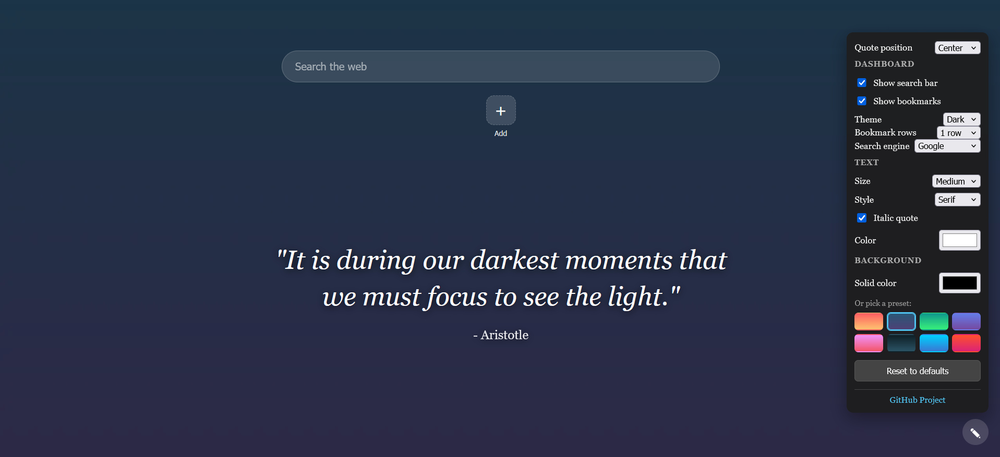

# Motivational Quotes for New Tab

This extension replaces your default new tab with a clean and distraction-free motivational quote. I built this as a lightweight and privacy-focused project that prioritizes speed and easy customization.

## Why I Built This

A personal hobby project: fast to open, pleasant to read, and easy to make your own.

## Features

* **Daily Inspiration**: See a new motivational quote every time you open a new tab.
* **Minimalist Design**: The quote stays front and center, with smooth fade-in animations.
* **Useful Tools**: 
  * Live clock and date with 12-hour or 24-hour options.
  * A time-based greeting.
  * A dashboard option to show a search bar and your favorite bookmarks.
  * Click to copy quotes directly to your clipboard.
  * Save your favorite quotes to view them later.
  * View a history of your recently seen quotes so you never lose a good one.
  * Export and import your custom settings, favorites, and bookmarks as a backup.
* **Custom Appearance**: Click the edit button in the bottom right to change how things look.
  * **Text**: Adjust the size, choose between sans, serif, monospace, cursive, or system fonts, toggle italics, and pick any text color.
  * **Background**: Pick a solid color, select one of the bundled gradient presets, or upload your own custom background image.
  * **Layout**: Move the quote to the center, top, or bottom of the screen.
  * **Reset**: Easily restore the default settings with a confirmation prompt.
* **Speed**: Local presets and bundled quotes keep your new tabs loading instantly. It fetches fresh quotes in the background when you are online.

## Privacy and Safety

Your privacy is the main priority here. This extension is built to handle as little data as possible.

* **External Data**: Fresh quotes are fetched from the [ZenQuotes](https://zenquotes.io/) API. No personal data or identifiers are ever sent with these requests.
* **Local Customization**: All your settings, favorite quotes, bookmarks, and custom background images are stored locally in your browser. Nothing is ever uploaded to a server.
* **No Tracking**: There is zero tracking of your browsing history or usage.
* **No Data Collection**: No personal information is collected, stored, or sold.
* **Minimal Permissions**: The only permissions used are local storage for your settings and network access limited to the quote API.
* **Open Source**: The code is completely transparent with no ads or hidden scripts.

## Development

If you want to generate the bundled background images, you can run the following commands:

```bash
python -m pip install pillow
python scripts/gen_backgrounds.py
```

## License

MIT License: free to explore, fork, or learn from.

---
Developed with ❤️ by Akarsh T P


